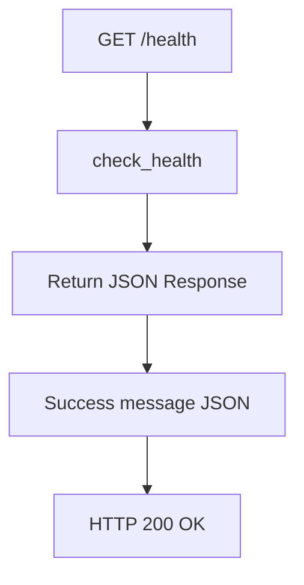
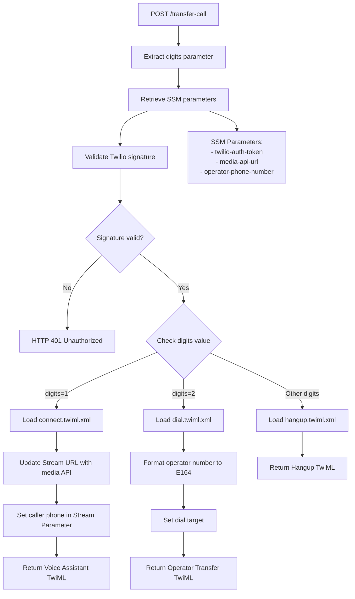
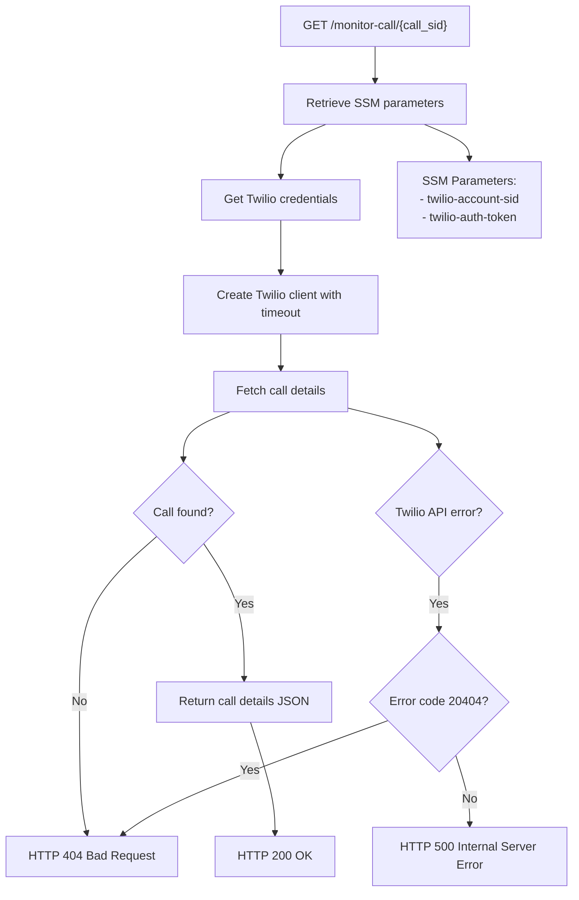
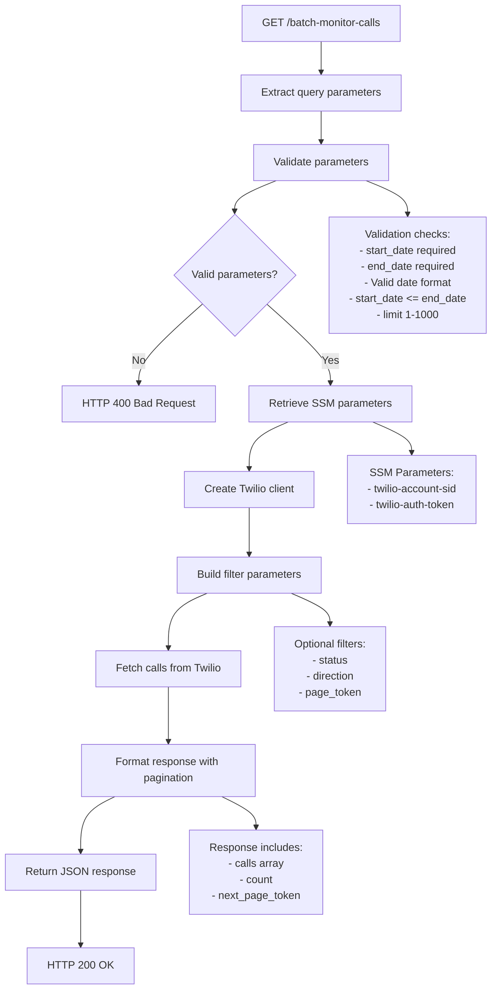
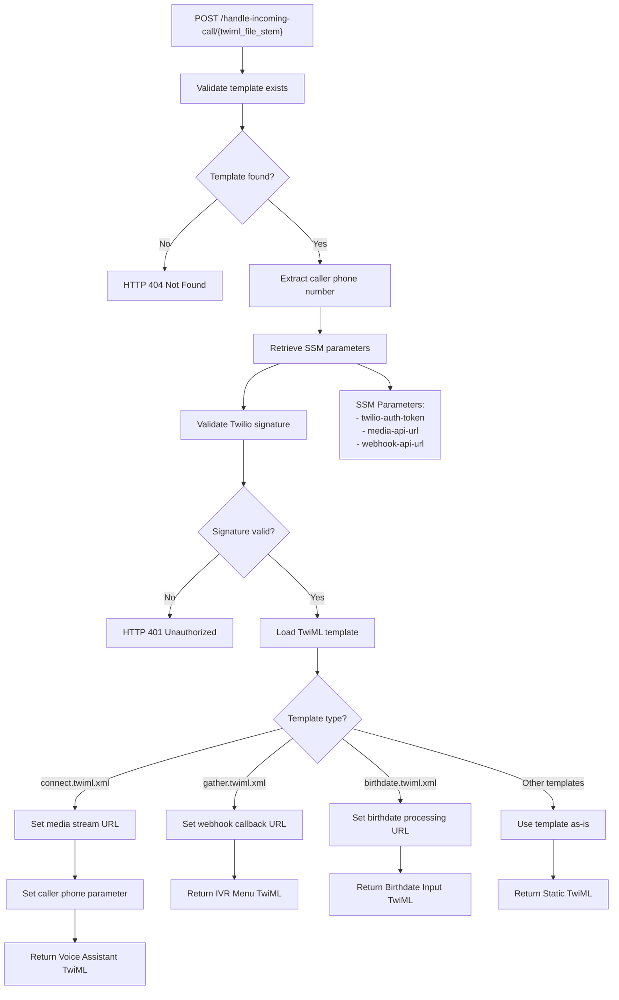
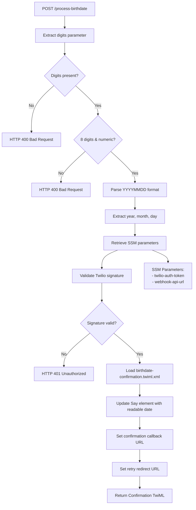
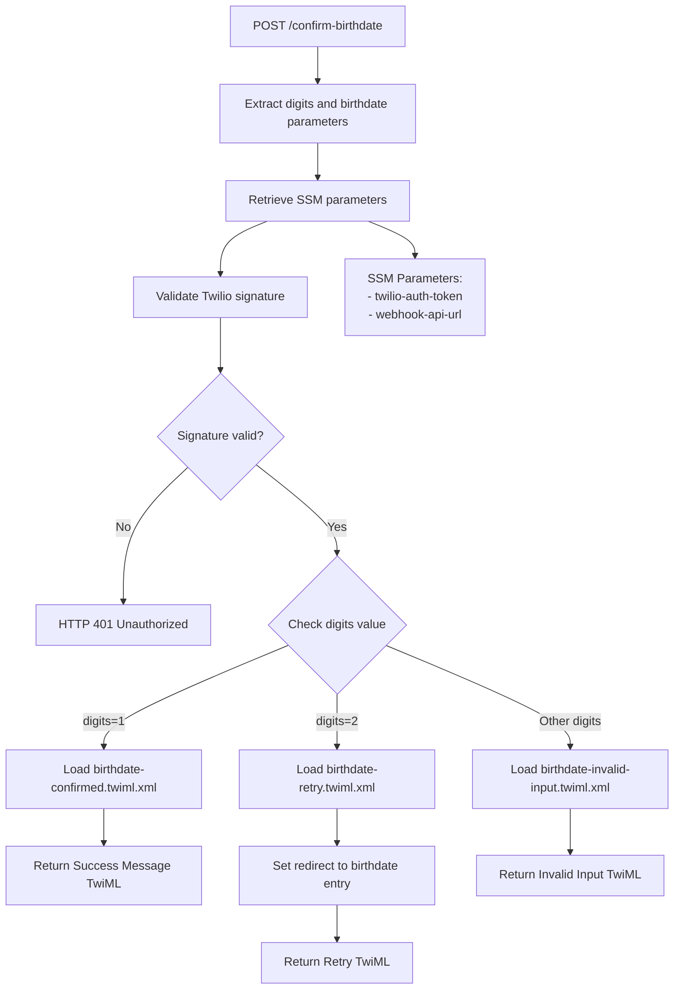
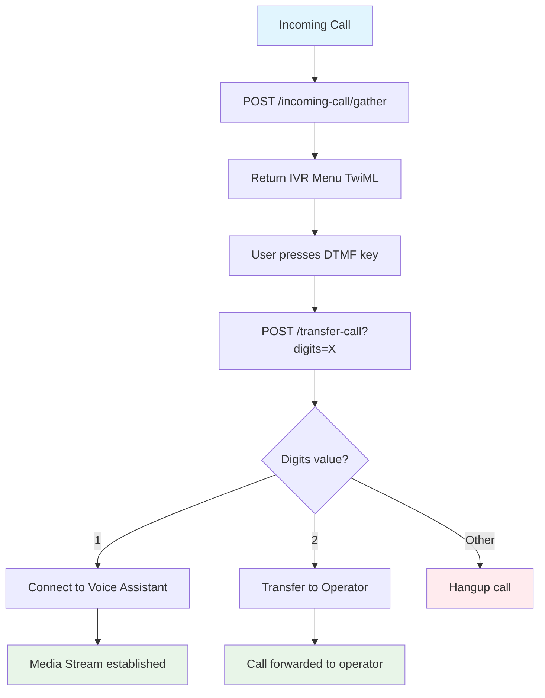
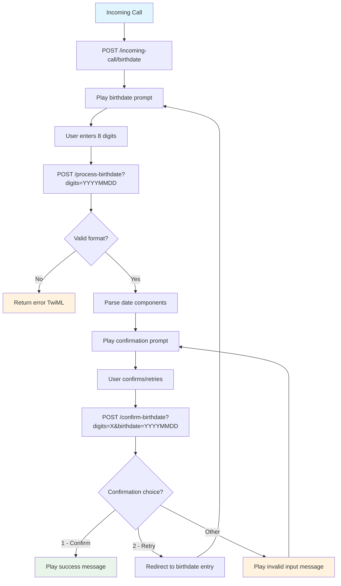
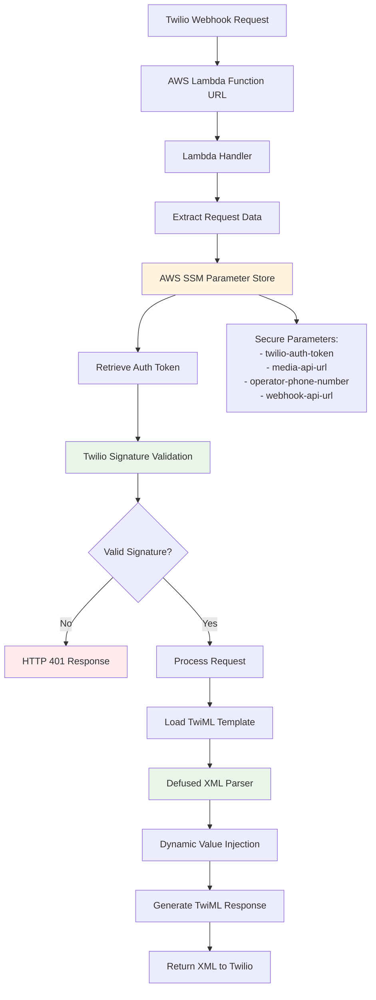

# API Endpoint Workflows

This document contains Mermaid diagrams showing the workflow for each API endpoint in the Twilio webhook Lambda function.

## Overview

The Twilio webhook Lambda function provides a comprehensive set of endpoints for handling voice calls, monitoring call status, and managing interactive voice response (IVR) flows. The API includes:

- **Health Check** - Basic endpoint for monitoring Lambda function status
- **Call Handling** - Process incoming calls with TwiML templates
- **Call Transfer** - Route calls based on DTMF input
- **Call Monitoring** - Retrieve individual and batch call information
- **Digit Processing** - Handle user input for features like birthdate collection

All POST endpoints require Twilio signature validation for security, while GET endpoints are designed for internal monitoring and reporting.

## Health Check Endpoint

## Transfer Call Endpoint

## Monitor Call Endpoint

## Batch Monitor Calls Endpoint

## Incoming Call Endpoint

## Process Birthdate Endpoint

## Confirm Birthdate Endpoint

## Complete Call Flow

## Birthdate Collection Flow

## Security and Infrastructure Components

